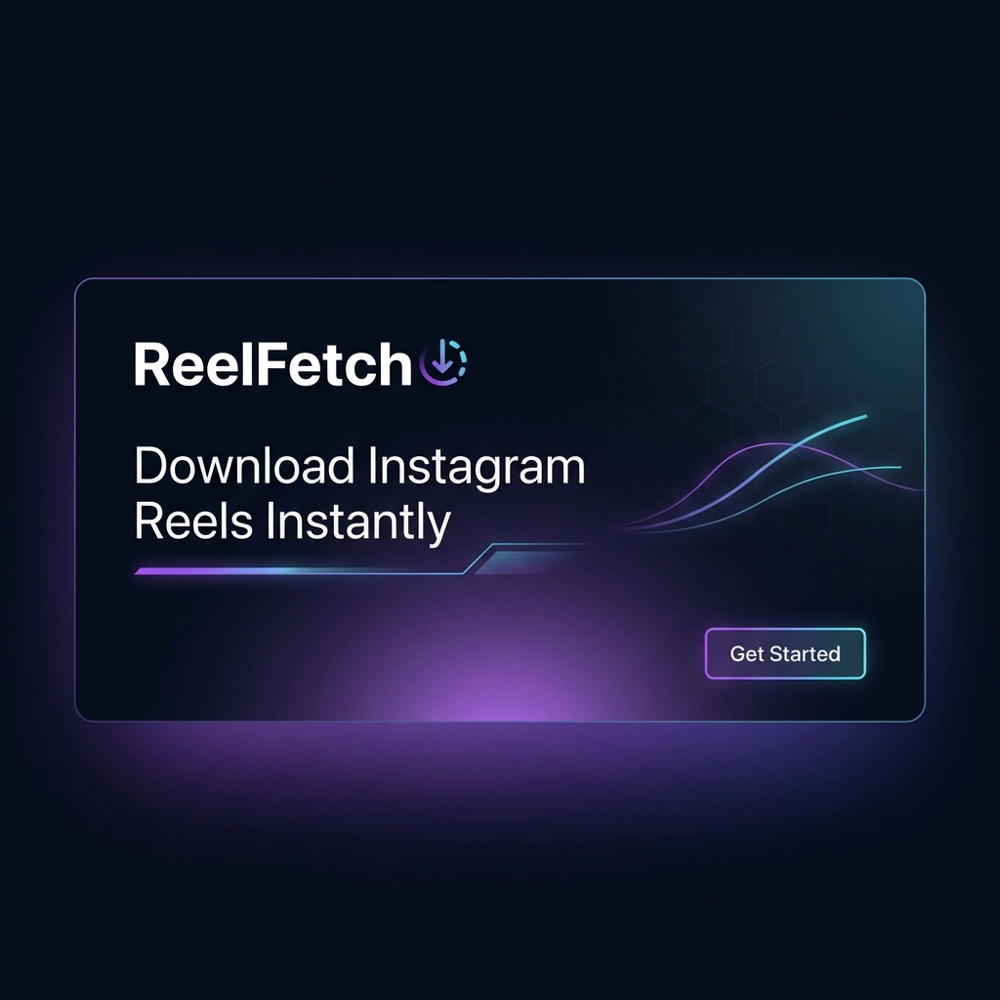

# 🎬 ReelFetch

> **Download Instagram Reels Instantly** - Fast, Free & HD Quality

[](https://nextjs.org/)
[](https://www.typescriptlang.org/)
[](https://tailwindcss.com/)
[](LICENSE)

ReelFetch is a production-ready Instagram Reel Downloader web application. It allows users to download Instagram Reels in HD quality without requiring login or any app installation.



---

## ✨ Features

### Core Features
- 🔗 **Single Input** - Paste Instagram Reel URL and download
- ✅ **URL Validation** - Validates URL before processing
- 📋 **Metadata Extraction** - Fetches thumbnail, username, caption
- 📹 **HD Quality** - Downloads reels in the highest available quality
- ⚡ **Fast Processing** - Downloads complete in under 5 seconds
- 🚫 **Clear Errors** - Helpful error messages for common issues

### UI/UX
- 🎨 **Modern Design** - Clean, minimal landing page with premium aesthetics
- 🌙 **Dark/Light Mode** - Theme toggle with system preference support
- 📱 **Mobile-First** - Fully responsive design for all devices
- 🎭 **Animations** - Smooth micro-animations and transitions
- 👁️ **Preview Cards** - View reel thumbnail and author before downloading

### Technical
- ⚛️ **Next.js 16** - App Router with server-side rendering
- 🎨 **Tailwind CSS 4** - Modern utility-first styling
- 🔒 **Rate Limiting** - Per-IP rate limiting to prevent abuse
- 💾 **Caching** - Smart caching for repeated URL requests
- 🛡️ **Security** - No user data stored, secure headers
- 🐳 **Docker Ready** - Containerized for easy deployment

---

## 🚀 Quick Start

### Prerequisites
- Node.js 18.0 or higher
- npm or yarn

### Installation

1. **Clone the repository**
   ```bash
   git clone https://github.com/yourusername/reelfetch.git
   cd reelfetch
   ```

2. **Install dependencies**
   ```bash
   npm install
   ```

3. **Set up environment variables**
   ```bash
   cp .env.example .env.local
   ```

4. **Run development server**
   ```bash
   npm run dev
   ```

5. **Open http://localhost:3000**

---

## 📁 Project Structure

```
reelfetch/
├── app/                          # Next.js App Router
│   ├── api/                      # API Routes
│   │   ├── fetch-reel/          # Reel fetching endpoint
│   │   └── download/            # Video download proxy
│   ├── how-to-download.../      # How-to guide page
│   ├── privacy-policy/          # Privacy policy page
│   ├── terms/                   # Terms of service page
│   ├── globals.css              # Global styles
│   ├── layout.tsx               # Root layout
│   ├── page.tsx                 # Home page
│   ├── sitemap.ts               # Dynamic sitemap
│   └── robots.ts                # Robots.txt
├── components/
│   ├── providers/               # Context providers
│   │   └── ThemeProvider.tsx
│   └── ui/                      # UI components
│       ├── Header.tsx
│       ├── Footer.tsx
│       ├── DownloadForm.tsx
│       ├── PreviewCard.tsx
│       ├── ErrorDisplay.tsx
│       └── ...
├── hooks/                       # Custom React hooks
│   └── useReelDownloader.ts
├── lib/                         # Utilities and helpers
│   ├── cache.ts                 # Caching logic
│   ├── constants.ts             # App constants
│   ├── instagram.ts             # Instagram fetching
│   ├── rate-limit.ts            # Rate limiting
│   ├── types.ts                 # TypeScript types
│   └── utils.ts                 # Utility functions
├── public/                      # Static assets
├── .env.example                 # Environment template
├── Dockerfile                   # Production Docker
├── Dockerfile.dev               # Development Docker
├── docker-compose.yml           # Docker Compose
└── README.md                    # This file
```

---

## ⚙️ Environment Variables

| Variable | Description | Default |
|----------|-------------|---------|
| `NEXT_PUBLIC_APP_NAME` | Application name | `ReelFetch` |
| `NEXT_PUBLIC_APP_URL` | Base URL | `http://localhost:3000` |
| `RATE_LIMIT_MAX_REQUESTS` | Max requests per IP per window | `10` |
| `RATE_LIMIT_WINDOW_SECONDS` | Rate limit window duration | `60` |
| `CACHE_TTL_SECONDS` | Cache time-to-live | `300` |
| `ENABLE_PRO_FEATURES` | Enable Pro features | `false` |
| `ENABLE_STRIPE` | Enable Stripe integration | `false` |

---

## 🐳 Docker Deployment

### Using Docker Compose

**Development:**
```bash
npm run docker:dev
# or
docker compose up dev
```

**Production:**
```bash
npm run docker:prod
# or
docker compose up prod --build
```

### Manual Docker Build

```bash
# Build the image
docker build -t reelfetch .

# Run the container
docker run -p 3000:3000 reelfetch
```

---

## 🚢 Deployment

### Vercel (Recommended)

1. Push your code to GitHub
2. Import project in [Vercel](https://vercel.com)
3. Add environment variables
4. Deploy!

[](https://vercel.com/new/clone?repository-url=https://github.com/yourusername/reelfetch)

### Railway

1. Create new project in [Railway](https://railway.app)
2. Connect GitHub repository
3. Add environment variables
4. Deploy!

### Fly.io

```bash
# Install flyctl
curl -L https://fly.io/install.sh | sh

# Login
fly auth login

# Launch
fly launch

# Deploy
fly deploy
```

---

## 📈 SEO Features

- ✅ Server-side rendering for fast initial load
- ✅ Dynamic sitemap generation
- ✅ Robots.txt configuration
- ✅ OpenGraph meta tags
- ✅ Twitter Card support
- ✅ Schema.org structured data
- ✅ SEO-friendly URLs
- ✅ Canonical URLs

---

## 🔐 Safety & Compliance

- ❌ No user login required
- ❌ No permanent storage of downloaded videos
- ✅ Temporary file cleanup
- ✅ Clear disclaimer displayed
- ✅ Rate limiting to prevent abuse
- ✅ Respects Instagram's robots.txt

---

## 💰 Phase 2 Roadmap (Monetization)

- [ ] Google AdSense integration
- [ ] Pro Mode subscription
  - [ ] No ads
  - [ ] Faster downloads
  - [ ] Bulk downloads
- [ ] Stripe payment integration
- [ ] User accounts (optional)

---

## 🌐 Optional Enhancements

- [ ] Multi-language support (i18n)
- [ ] Instagram Stories download
- [ ] Instagram Highlights download
- [ ] Queue system for heavy traffic
- [ ] Progressive Web App (PWA)
- [ ] Download history (local storage)

---

## 🛠️ Development

### Commands

```bash
# Development server
npm run dev

# Build for production
npm run build

# Start production server
npm run start

# Run linting
npm run lint

# Fix linting issues
npm run lint:fix

# Type checking
npm run type-check
```

### Tech Stack

- **Framework:** Next.js 16 (App Router)
- **Language:** TypeScript 5
- **Styling:** Tailwind CSS 4
- **Icons:** Lucide React
- **Theme:** next-themes
- **Analytics:** Vercel Analytics

---

## 🤝 Contributing

Contributions are welcome! Please feel free to submit a Pull Request.

1. Fork the repository
2. Create your feature branch (`git checkout -b feature/amazing-feature`)
3. Commit your changes (`git commit -m 'Add amazing feature'`)
4. Push to the branch (`git push origin feature/amazing-feature`)
5. Open a Pull Request

---

## 📄 License

This project is licensed under the MIT License - see the [LICENSE](LICENSE) file for details.

---

## ⚠️ Disclaimer

**For personal use only.** Respect content creator rights. ReelFetch is not affiliated with Instagram or Meta Platforms, Inc. Users are responsible for ensuring they have the right to download and use the content.

---

## 🙏 Acknowledgments

- [Next.js](https://nextjs.org/) - The React Framework
- [Tailwind CSS](https://tailwindcss.com/) - Utility-first CSS
- [Lucide](https://lucide.dev/) - Beautiful icons
- [Vercel](https://vercel.com/) - Deployment platform

---

<p align="center">
  Made with ❤️ for content lovers
</p>
